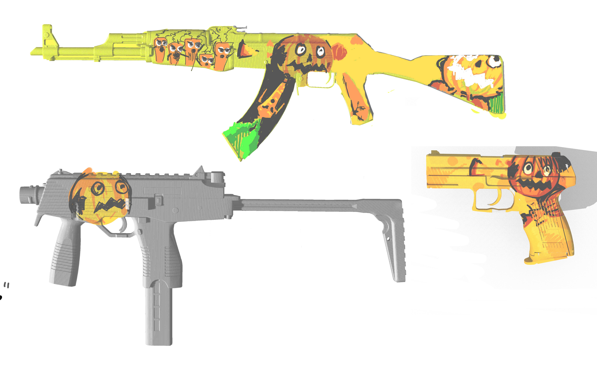
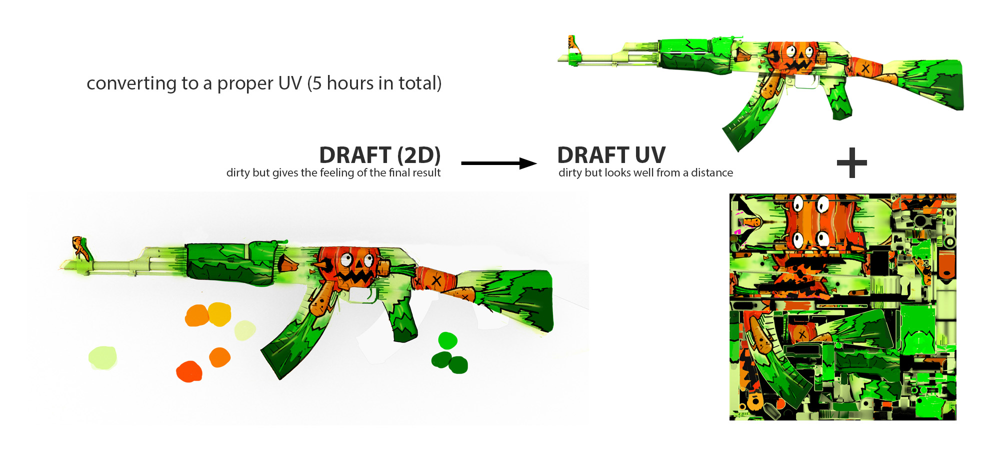

# Salad Maker: How To Start Making CSGO Skins in 2021

_Note: Feel free to send me PR requests to improve this guide_

_Note: If you want to see more of my work, check out [my portfolio](https://www.coroflot.com/qutepixels)_

In July 2021 Valve announced a million dollar [Dreams & Nightmares](https://counter-strike.net/dreams) weapon skin competition and I was instantly hooked. Making skins for [CSGO](https://en.wikipedia.org/wiki/Counter-Strike:_Global_Offensive) sounded like a really fun challenge and the loot was good. I knew absolutely nothing about creating 3D textures so as I went along, I documented every step of my journey. Here's a guide I wish existed when I started. And here's [my first skin](https://steamcommunity.com/sharedfiles/filedetails/?id=2633279524), the **Salad Maker**:


## Contents

_Note: If you are here just to read the tutorial part and you don't care about the bigger picture or details, jump straight to Chapters 3 and 4_

- **1. PRELUDE** `# small intro`
- **2. RECONNAISSANCE** `# what do other people do? what not to do?`
    - 2.1 General advice
    - 2.2 Dreams & Nightmares: competition research
- **3. "HELLO WORLD" or ZERO-TO-HERO (Photoshop)** `# "hello world" of CSGO skin making or how to create a very s1mple skin using only Photoshop`
    - 3.1 Before you start
        - 3.1.1 Setup
    - 3.2 Creating the texture
        - 3.2.1 Prepare your template
        - 3.2.2 Drawing Techniques
        - 3.2.3 Testing skins in Workshop
        - 3.2.4 Testing skins in-game
    - 3.3 Submission and Marketing
        - 3.3.1 Submission files
        - 3.3.2 Packaging
        - 3.3.3 Submit to Workshop
- **4. ARTISTIC PROCESS** `# how did I create Salad Maker`
    - 4.1 Template
    - 4.2 Get familiar with your gun
    - 4.3 Sketch
    - 4.4 UV sculpting
    - 4.5 UV cleaning
    - 4.6 UV in-game integration
- **5. REFERENCES** `# useful knowledge resources`
    - 5.1 Official Valve documentation
    - 5.2 Skin browsers
    - 5.3 Books
    - 5.4 YouTube
    - 5.5 Community

## 1. PRELUDE

My biggest problem with learning how to create skins was figuring out and organizing all the steps you need to go through in order to create a playable skin - from having a design idea to actually making a proper submission. And it's not that there is not enough information about it on the internet. It's that after all these years, it's still scattered all around and most tutorials either left me with too many options (should I use 3DCoat because everyone seems to use it? or should I use Blender because more recent tutorials seem to adopt it to make skins? Or should I use all of them together because some skin makers boast about using so many programs?) or simply left me scratching my head thinking "well, is that all I need to know or do I need to know more?". And, like, sorry Valve - I love you - but how could / should someone without prior experience of creating professional textures decipher [official docs](https://developer.valvesoftware.com/wiki/Texture) that look like this? (I'm a developer myself, so I know the answer: **you can't. And you shouldn't.**)


## 2. RECONNAISSANCE

### 2.1 General Advice

Here's the list of main design guidelines I gathered from all the sources I've read and watched:

- what **TO CONSIDER**:
    - for starters **use just Custom Paint or Gunsmith** finishes for your skins (imagine it like this: custom paint = "the way you see your design on the screen", gunsmith = "the way you would see your design printed on metal"). All the mumbo-jumbo with other finish types will potentially confuse you immensely plus nobody wants it (plus some other finishes have different definitions of alpha maps or even the whole way the skin is made, so IMHO don't bother)
        - **"Solid Color" or "Anodized" finished types are officially adviced against**
        - **Patina finish has a different type of alpha channel** compared to relatively s1mple ones used for Custom Paint or Gunsmith
        - A **normal map can give the weapon finish an appearance of depth or bumps** without adding more polygons through the use of lighting. Normal maps **can be applied to Patina, Custom Paint, and Gunsmith** finish styles only.
        - Also here are the Workshop stats as of 08/11/2021:
    ```
        - Total (230146 submissions -> 804 in-game) [3.5 approved skins per 1000 submissions]
            - Anodized (28884 -> 34) [1.177]
                - Anodized (549 -> 0) [-]
                - Anodized Airbrushed (9606 -> 8) [0.833]
                - Anodized Multicolored (18729 -> 28) [1.495]
            - Custom Paint (120123 -> 236) [1.965]
            - Patina (26006 -> 43) [1.653]
            - Gunsmith (18361 -> 121) [6.590]
            - Other (29737 -> 30) [1.008]
                - Hydrographic (13008 -> 14) [1.076]
                - Solid Color (4999 -> 0) [-]
                - Spray-Paint (11730 -> 16) [1.364]
    ```
    - **consider making skins for weapons that have few high quality submissions**
        - **same goes for lower salience items** (everybody tries to draw Classified and Covert skins nowadays)
    - **offset-randomised patterns are under-represented** and have a higher chance of being accepted
    - **don't forget about popularity.** Getting your finish upvoted and noticed is a great way to demonstrate desirability and collect feedback that will help you iterate on it. **One of the factors we use to gauge community interest is the popularity of a submission**.
- what **NOT TO DO**:
    - **obscene items** (Don't even bother.)
        - Skulls or blood? **Add a low-violence version too** (suspecting it's because of the Chinese market)
    - **promotional Designs**
    - **copyright infringement**
    - **national, political, or religious symbols**
    - **don't deviate too far from the tone or fiction of CS:GO**
    - **don’t include grime, scratches, ambient occlusion, or details from the weapon** in your finish. The composite system will do it for you.
    - themes
        - [[1]](https://www.youtube.com/watch?v=QP3btwpkWQ) **don't create sci-fi skins**
    - colors
        - be **very aware of the salience / rarity** of the skin you are making
        - don't do **gold weapons** (those have a special meaning to the Counter-Strike community, and are reserved for special events)
        - don't do **monochromatic red weapons** (red/black/white), that color palette is overused
        - **do not use complete black or white or fully saturated colors** as the in-game light is "multiplied on top of it" so black/white/saturated colors will "break the in-game lighting": completely black spots won't reflect light and completely white one won't be darker in the shadows.
        - **too dark or bright skins won't get accepted** (creator of the "Decimator" [was asked to tone his skin down](https://www.youtube.com/watch?v=Do7LoiFgkS8) in order for it to be accepted)
        - **no intense gradients** as DXT1 and DXT5 use block compression (like JPEG) and produce similar artefacts. Reduce saturation and intensity to fix it.

### 2.2 Dreams & Nightmares: Competition Research

So right before I started to create my skin for the Dreams & Nightmares contest, I decided to look at the competition to get a feeling what am I competing against. Looking at the competition helped me a lot to maintain the right design direction, mainly in three ways:

- **Understanding the level of the competition** (what is "good enough"?)
- **Which designs / weapons are under-/overrepresented** (what is "original" compared to the competiton?)
- **Common mistakes** (things "not to do"?)

First thing I did was to go to [CSGO Stash](https://csgostash.com) and go through the skins of each gun mentioned in the competition rules. Then I filtered out skins having desired salience and put them side-by-side. Apart from one "dark horse" skin (MP7) that still didn't have a single skin of desired salience level in the game, I now had an **overview of what was hand-picked and accepted into the game over the years**:


Then I went to the workshop page where I could see all the competition entries so far. At the time there were ~11000 submissions. I browsed through the top 1000 most popular ones (stopping after that seemed reasonable because when scrolling beyond top 1000, the quality of submissions seemed to get worse and worse and on average it was much worse than the top 100). From the top 1000 I picked 154 that seemed to be exceptionally good (of course, that part is subjective but I also tried to just pick the best, regardless if they actually fit the contest or not). Anyways, **assuming that these 154 hand-picked submissions represented a good portion of the winner candidates**, I took a deeper look at them one-by-one.

That gave me a quick list of **10 useful observations on competition** (note: I didn't try to make it a round number, it just happened to be 10 in total):

- I quickly discarded 96 skins (~62%) from my list due to quite s1mple reasons:
    - 48 had **(1) no (obvious) relation to the main theme of the contest: dreams and nightmares**
    - 22 were **(2) not fitting the salience level defined in the competition**. Usually those submissions were too colorful or brash whereas most skins needed for the competition were of lower salience levels
    - 9 were **(3) obscene in a way that even if you make a clean version of it, the core design idea would be lost**
    - 5 were skins for a **(4) weapon not used in the contest**
    - 9 were simply **(5) duplicates or color variations of some entries I already had in my hand-picked list of 154 skins**
    - 3 looked cool in a thumbnail but **(6) completely unprofessional when looking at them closely**
- **(7) Some weapons were seriously underrepresented**. Weapons like SCAR-20, G3SG1 or MP5-SD had very few (1-2) real competitors - compared to around 5-20 great entries for each of the other guns in the competition
- **(8) Very few skins played with the weapon-specific details or dynamics** (the way that gun actually sounds, its reload process, parts that actually move while shooting etc.). Most were simply an art piece "drawn" into the skin.
- **(9) There were many designs revolving around similar ideas / themes**:
    - Dragons
    - Octopuses / mermaids
    - Japanese patterns (the kind you see on Yakuza tattoos)

Now that I had filtered out my real competition, I put all of the submissions side-by-side and compared them to the images that I created from already existing in-game skins. That gave me a nice **overview of the "skin family" that the winners will need to fit into - and current competition level**. Here's an example of what I had for the P2000:


Which brought me to the observation number 10: **(10) some submissions were too similar pattern/color-wise to some already existing skin in the game**.

Note: that P2000 competition overview was something I was using to then collaborate on my second skin for the competition, "[The Cloud Surfer](https://steamcommunity.com/sharedfiles/filedetails/?id=2633374064)":


## 3. "HELLO WORLD" or ZERO-TO-HERO (Photoshop)

Ok, here's the meaty part, a "hello world" project for CSGO skin making using only Photoshop. It's good to separate this chapter from the rest as it describes **the process parts that all skin makers have to go through**. Think of it as the foundation that you will build your creative process around later on (I describe mine in Chapter 4). I thought a lot about which format to pick for it (YouTube video / blog post / reddit post etc.) as they all have their pros and cons and decided to do it as a GitHub repo. In that way this tutorial could evolve with time and not get outdated as quickly.

First let's get the feeling of what we are trying to do here and get familiar with some complicated words that are used when talking about 3D textures. And then we will create something like this:


### 3.1 Before you start

Generally speaking, you are creating a texture for a 3D model of your choice and **it doesn't matter which software you use to create it** (so take Photoshop, 3DCoat, Blender - whatever program you're comfortable with). Main thing is you save it in [.tga format (aka TARGA)](https://en.wikipedia.org/wiki/Truevision_TGA). That .tga file is a normal flat 2D image that represents the texture (or the [UV](https://en.wikipedia.org/wiki/UV_mapping)) of our 3D model. UV is a standard way of "flattening" the textures into a 2D image and the way it works is that the texture is split into many pieces that are then flattened and spread across a 2D image. Now this is important to note because that also means that when we look at our 3D model with the texture applied to it, these "flattened" UV bits are "stretched around the model" meaning that often **your texture will be a bit distorted here and there**. That means that something that looks like a straight line on a 3D model could look like a warped curve on our UV. Here's an example. And don't worry, you will get used to it pretty quickly:


So we will download the standard CSGO weapon models and their corresponding UVs (means you don't need to bother with how they look: **UVs and models are fixed by Valve**) - and start drawing over them while having both our 3D model view and its UV side-by-side. In that way drawing on a 3D model would instantly update its UV and drawing on UV would update the 3D model. Our goal is to create a **perfect UV** because **that is the only way to achieve the best texture quality possible**. So for the vast majority of time you would be drawin on a 3D model fixing some small bits that look wrong - and then look at those changes on the UV and polish them until they are pixel-perfect. Ah yes, another thing to remember: **UV is a [raster](https://en.wikipedia.org/wiki/Raster_graphics) image**. And raster images are **lossy** meaning that if you rotate / rescale / warp or transform anything in it, it loses some of its quality. Keep that in mind so that when you create your final UV, you keep the amount of such transformations to a minimum. That also means that it's better to start with a bigger resolution of our UV and downsize it later on if needed. **Because upscaling it later on would inevitably make your work pixelated** which would mean all your precious work (and it's gonna be hours my friend) was done in vain :P For Counter-Strike weapon skins you will need a 2048x2048 UV but **Valve texture format [supports UVs up to 4096x4096](https://developer.valvesoftware.com/wiki/Valve_Texture_Format) so we can safely work with 4096x4096** up until we have our texture ready for submission - only then we will rescale it to 2048x2048 and send the result to Valve.

Also **your texture will be postprocessed before it enters the game**. This tutorial is constructed in such a way that you could ignore this bit. But if you want a proper understanding of what CSGO does with your texture, here it is. To the best of my understanding, every skin in-game is more or less rendered in this order:

1. 3D model is wrapped into its default "naked" skin
2. Then comes your texture (including all the transparent bits defined in the **alpha channel** - which we can - and will - ignore for simplicity reasons)
3. **AO texture** is added on top of it (if you are interested in getting that texture and adding to your Photoshop layers to get a realisting feeling of how it will look in-game, watch 2 minutes of this video: [CSGO skin making full process - PART 2 - Onto Model](https://youtu.be/Zu-xzLEl5rU?t=881)). It might look like a big change if you look at the screen below - but to be honest it's barely visible on the 3D model when applied, so feel free to ignore it
4. Light and shadows react with your texture according to the **normal map** (ignore it, we won't deal with it in this tutorial) and the **Workshop parameters .txt file** that you need to provide together with your texture (we will go through them later in this chapter but also, for simplicity reasons we will set them so that what you see in the game would be very similar to what you finish up with in Photoshop)


#### 3.1.1 Setup

Let's install and configure all the things we need for skin making first:

- Hardware
    - Any kind of **graphics tablet will be super useful** as it speeds up the whole process by a lot
- Software
    - Install **[Photoshop (webpage)](https://www.adobe.com/uk/products/photoshop/free-trial-download.html)**
    - Install **[Steam (webpage)](https://store.steampowered.com/) + [CSGO (webpage)](https://store.steampowered.com/app/730/CounterStrike_Global_Offensive/)** (also for the D&N contest they had a requirement that you have a **Steam account with at least 5$ being spent** to ensure you are a real person. Not sure it applies to all skin submissions in general but keep it in mind)
    - **Workshop Workbench**. It comes with CSGO (and... sigh... launches only from inside of CSGO) so no need to install that. That's a tool you will be using quite a lot for:
        - simulating and testing skin wear
        - double-checking consistency between how the game and your graphics program interprets the UV
        - quick tests for your texture looks
        - define the CSGO-specific texture parameters
        - submitting the final texture
    - **download [VTFedit (.ZIP, 2.3 MB)](https://valvedev.info/tools/vtfedit/vtfedit.zip)** to convert your .TGA to Valve's texture format .VTF
    - **download [GCFScape (.ZIP, 0.3 MB)](https://valvedev.info/tools/gcfscape/gcfscape.zip)** to extract existing game resources if needed
- Assets
    - Enter CSGO and **buy several cheap skins, at lest one per weapon you are planning to redesign**. You will need that because testing your skin in-game means temporarily replacing the actual skin you have in your collection. Small tip: **if you see a skin with a similar color palette to the skin you are making, buy it**. It will help a lot later on to color correct your skin and make it fit with the overall CSGO in-game look
    - **download [official UV sheets, models and examples (.ZIP, 3.5 MB)](http://cdn-01-origin.steampowered.com/apps/csgo/workshop/workbench_materials.zip)**

**Accurate folder structure** will save you TONS of time as you will be jumping between folders a lot. I would suggest to create a separate folder (something like `csgo-skin-making`) and inside of it create these folders:

- **/csgo-skin-making** `# to keep everything in one place`
    - **/finals** `# collection of folders (1 per skin), each including all submission assets`
    - **/drafts** `# for .tga / .vtf files that you will be testing in Workshop and in-game`
    - **/materials** `# all materials like OBJs, UVs, AO maps or skins created by other people`
        - **/obj** `# for Workshop OBJs`
        - **/uv** `# for Workshop UVs`
        - **/skins** `# skins created by other people`
    - **/software** `# for GCFScape, VTFedit and god knows what else you will use`
    - **/inspiration** `# photos / music / images - whatever inspired you`

### 3.2 Creating the texture

#### 3.2.1 Prepare your template

- open Photoshop (we will need `History / 3D / Layers` tabs. Make sure you know where they are. If you don't, go to `Window -> 3D`, `Window -> Layers` and `Window -> History`. That will show/hide those panels for you)
    - `File` -> `Open` -> [select your OBJ file. Pick a reasonable resolution like 2000x1500px]
    - `3D` -> `Current View`
        - `View` -> `Right` (now the model is shown from **the right side that you see in the game**. Hint: if you change the game settings to show the weapon model on the left side of the screen, **it will not show you the other side of your skin. The game will just mirror it and you will see the same side of the skin you see normally**)
            - Keep it in mind if you will write text on your skin. **Text will just get mirrored**
            - Keep it in mind if you create lower salience skins. **You can design outer half of the skin (the one that other players would see more easily) to look more muted and less recognizeable from a distance**
        - `1/1` -> change the value of the slider until it more or less zoomed in (`1/0.17` worked well in my case)
    - `3D` -> `Infinite View`
        - Drag'n'drop the "light sphere" that you will see appearing on top of the model until your gun is reasonably lighted up
    - `3D` -> `weapon`
        - `Layers` (`F7` or check that Window -> Layers is checked) -> double-click on a line saying something like `... Texture`. It will open the texture **linked to the 3D view** meaning that whatever you draw on the model will appear on the texture (UV) and [vice versa](https://en.wikipedia.org/wiki/Vice_Versa)
    - `Image` -> `Image Size` -> resize to `4096x4096px`
    - `File` -> `Open` -> [select your UV file for the same gun]
    - `Image` -> `Image Size` -> resize to `4096x4096px`
    - `CTRL + A`, `CTRL + C` (select all + copy)
    - go back into your Texture
        - fill the layer with the white color
        - paste (`CTRL + V`) the UV into a new layer (**name it `UV`**)
            - change UV layer blending from `Normal` to `Difference`
        - create a new layer (**name it `sketch`**)
        - hit `CTRL + S`
    - **from now on save your Texture window as PSD** - that will be your texture-in-progress file. And **don't merge layers**. Photoshop will do it automatically whenever you `Save As` the texture in `.tga` format.

Now your 3D model and its texture should look like this:


_Note: now **you can draw using a regular brush both on the 3D model and the texture** and both should update the other half automatically. **If it doesn't:** close the texture half, go to the model window and double-click on the "... Texture" layer to reopen the texture._

### 3.2.2 Drawing Techniques

When drawing on our UV layer, we can use all the Photoshop techniques we know. Because in the end it's just a 2D image. When we draw on a 3D model directly, we will be drawing using **projection mapping**. You could imagine it like this: if you draw a red circle on top of the 3D model, Photoshop will take each pixel of that circle we just drew - and "shoot it through the model" - and whichever part of the UV that "pixel shot" will cross first, will get painted in red.

In general we will do that projection mapping in one of the following s1mple ways:

- [project a brush] pick a brush, rotate the model so that you see the part of it you would like to paint, then **just paint**. Perfect for small corrections, messing around with the design shape etc. etc.
- [project a layer] create a new layer, draw or insert an image / photo / sketch into it so that it looks nicely over the 3D model - and then **right click on the layer -> `Merge Down`**. That will use projection mapping to project the whole layer onto UV

Let's use both of these techniques now. Let's search for some cool pattern image on the internet. I quickly searched for "pattern" in duckduckgo and picked [this one](https://wallup.net/minimalism-pattern-digital-art-2/) (I do not own any copyright over it):


Now switch to the 3D view in Photoshop (where you see your 3D model) and paste that image on top of it _as a new layer_. Then merge it down. I did it several times over the model in different places until I got a nice look. Then I drew a small smiley directly over the model using a small brush:


Now if you look at your UV it probably looks like a mess and super pixelated. That's where **the most tedious part comes in: the cleanup**. So after you like the way your skin looks, you would basically go over the UV map and reconstruct all of it until it's pixel-perfect. But let's ignore that for now - save that process for your first skin you would actually want to submit.

### 3.2.3 Testing skins in Workshop

- convert your texture into `.vtf` (Valve Texture Format):
    - Save your texture as .tga into your `/drafts` folder (or however you named it, main thing is don't put too many .tga files into it)
        - **save as 24-bit** if you are not modifying the alpha channel (we are not)
        - save as 32-bit if you do (keep in mind just in case)
    - Open `VTFedit`
    - `Tools` -> `Convert Folder`
        - `Input folder`: select your `/drafts` folder
        - `Output folder`: select your `/drafts` folder
        - make sure `To VTF` is checked
            - check just in case that `VTFedit` converts using `DXT5` format (most common for Custom Paint Job skins). And if you will ever want to create randomized skin patterns like [MP5-SD | Lab Rats](https://csgostash.com/skin/1036/MP5-SD-Lab-Rats), use `DXT1`
        - click `Convert` (it will generate both `.vtf` and `.vmt` files in your `/drafts` folder)
- open CSGO
- open Workshop:
    - [only if you do it for the first time] `Settings` -> `Game Settings` -> `enable the console`
    - open console (press `~` on your keyboard (usually one button to the left from `1`))
    - type `workshop_workbench` and press `Enter`
- Now you should see a window with some kind of a gun being previewed. Let's set it so that the skin would look pretty much the same as in Photoshop. For that we need to open our .vtf file and remove all the random offset/rotation things:
    - bottom left: select your weapon (AK-47 in my case)
    - 1st top input: `Custom Paint Job`
    - 2nd top input: select the .vtf file that you created using `VTFedit` (it's in `./drafts`)
    - `ignore_weapon_size_scale`: true
    - `pattern_offset_x_end`: 0
    - `pattern_offset_y_end`: 0
    - `pattern_rotate_end`: 0
    - `wear_remap_max`: 0.7 (if it's the default 1.0, your skin will wear off A LOT. Set the limit of what is the maximum wear you find acceptable. **Wear limit is important as if your skin gets into the game, most of them will be worn out**. 0.7 stands for 70%, for example). There is a proper way of defining exactly which bits of the texture should wear and how much and [some people go to great lengths to make it pixel-perfect as well](https://www.youtube.com/watch?v=PEuj46C4N0I) but for simplicity reasons just set the higher wear limit and concentrate on your design first
    - light reflection parameters (play with those a lot). Here's a good start that will make it look pretty much the same way you see it in Photoshop:
        - `phongexponent`: 50
        - `phongintensity`: 5
        - `pearlescent`: 0

Also **always play with how your skin reflects light** (`phongexponent` / `phongintensity` / `pearlescent`). Various skin makers suggest one or good values but I have a feeling there are lots more combinations that work for different designs. For our s1mple skin I settled down on `150 / 100 / 2.0`. If you do the same you should see something like this:


Now play around with your gun and all the `Inspect` / `Reload` animations. Note that:
- you **won't be able to see the model from all angles**
- slowly inspect the whole model because **CSGO interpretation of UVs for some details is different from Photoshop** (for example, while I was able to define both front- and backside of the magazine in Photoshop, CSGO would use the same part of my UV for both - plus (sic) draw one of them upside down. A minor thing but that meant I had to improvise and change the original design a bit)
- if you update your .vtf file, Workshop won't recognize that automatically. **To redraw the updated texture you will need to click `Refresh` button on the bottom left**

#### 3.2.4 Testing skins in-game

Ok, testing skins in-game... Somehow I have an urge to make another Valve-Clippy meme here. The process is... how should I put it... it feels like cracking a game, cracking in a way one shouldn't be supposed to. Anyways, here's how you do it:

_Note: a good but not complete tutorial on this part is this YouTube video: [How to import custom skins into CS:GO 2021](https://www.youtube.com/watch?v=69_6wKqin-c)_

From now on we will mention our **CSGO directory** as `<csgo-directory>` (usually it's `C:\Program Files (x86)\Steam\steamapps\common\Counter-Strike Global Offensive\csgo` but might be different / on another hard-drive for you). And let's say your .vtf texture file was named `my-skin-test.vtf` or something (we will need that name in a couple of seconds)

- copy `my-skin-test.vtf` and `my-skin-test.vmt` into `<csgo-directory>\materials\models\weapons\customization\paints\custom`
    - if you go into `<csgo-directory>\materials\models` and `weapons` folder is missing (like it was in my case), **create those folders (`...\weapons\customization\paints\custom`) by yourself**
- open `<csgo-directory>\scripts\items`
- make a copy of `items_game.txt` in the same folder. **This is important** because we will edit `items_game.txt` to tell the game where should it take texture files for every skin. And as long as the original file is changed **you can't play official games and could be VAC banned**
- now remember the part in the very beginning where I mentioned you should buy some cheap skin for your weapon? We will replace that skin. Remember the name of the skin. For our AK-47 example, I will replace the "Safari Mesh" skin
- now you need to find what is the `name` of that skin in `items_game.txt`. Did you think it will be `Safari Mesh`? No. Pretty much all skins have some random names in that file and it's (absolutely) not obvious which one is which. So we will use [GitHub: items_game.txt weapon ID -> skin name mapping](https://github.com/Vankxr/node-csgo-items-parser/blob/master/skins.json) to find it (alternative sources: [[1]](https://pastebin.com/w7XTN5Yi), [[2]](https://www.unknowncheats.me/forum/counterstrike-global-offensive/235078-skins-spectrum-2-a.html)). In our case `Safari Mesh` is named `sp_mesh_tan`
- now in `items_game.txt` find the block describing Workshop values for `sp_mesh_tan`
    - **don't touch `name`, `description_string`, `description_tag` lines**
    - `"style" "7"` (means Custom Paint Job)
    - `"pattern" "my-skin-test"` (the filename of your .vtf file - without the `.vtf` extention. When you start the game, CSGO will look for `my-skin-test.vtf` and `my-skin-test.vmt` in `<csgo-directory>\materials\models\weapons\customization\paints\custom` and render it as a texture for the `sp_mesh_tan` skin which is AK-47 `Safari Mesh`)
    - then add all the other values as well
    
Here's what I got:


- now save the file
- launch CSGO
- equip the skin
- **create a custom map or a match with bots**. Remember: for now important game files are changed so playing official / ranked games **might get you a VAC ban**


_Note: if you overwrite `my-skin-test.vtf` and `my-skin-test.vmt` files, CSGO won't recognize a new skin. There is also no "Refresh" button. **You will need to restart the game and start the match again**_

_Note: if you want to play ranked again, **just make sure you returned `items_game.txt` to its original state** and restart the game. You don't need to delete all the `.vtf` or `.vmt` files you added to the game directories_

### 3.3 Submission and Marketing

Ok now we need to publish the whole thing and show the world how great we are. We will need to prepare our texture files and create a nice-looking "packaging": catchy name, beautiful cover image, a couple of screenshots etc.

#### 3.3.1 Submission files

Using steps in section `3.2.3` generate these 4 files that you will need to upload:

- **Resize your .tga file to 2048x2048** (that's what the Workshop Publish will require when you submit the texture) and save as a `final-skin-hello-world.tga`
- Convert it to `final-skin-hello-world.vtf`
- Set Workshop parameters and save them as `final-skin-hello-world.txt`
- create a 1920x1080 **cover image** and save it as `final-skin-hello-world.jpg`

_Note: cover image will be **the only image you can't change after you submit the skin** so make sure it's solid_

Creating a cover image is left up to your imagination. I would suggest that to be the only image where you actually create a fitting background for the skin. **The main purpose of the cover image is to make people stop for a second and want to actually see more about your skin**. It's not about being bold / honest / creative. Cover picture is about making people to give your skin a chance. It doesn't have to be super good but if it's bad people will just not click through other images and skip your skin without giving it a second look. Take a look at tons of other Workshop submissions that made it into the game. There are plenty ideas about how to make a good cover image.

I decided to have a very modest approach: view of the gun from the side, slight reflection of it at the bottom - and a very transparent upscaled piece of the main skin theme in the background (_Note: if you don't want to make it 1920x1080px, **make sure it's at least 16x9 ratio** otherwise Workshop will crop it_):


#### 3.3.2 Packaging

At minimum we will need to **come up with a good skin name**, prepare a **description** and **several good feature / in-game pictures**.

**Feature close-ups.** If you have some cool detail in your skin, make an image showing it. Now our "hello world" skin is quite s1mple and doesn't have any features. So we won't bother.

**In-game screenshots.** We will need at least 3 in-game screenshots: one **when you hold your gun normal** (this is how players would see it 95% of the time), one **when reloading** (especially if your skin plays with that animation or if the magazine design is important) and one **showing off your gun** (this is how people seem to show their skins on streams).

_Note: **Do not process screenshots, leave them as is**: [[1]](http://counter-strike.net/workshop/workshopstyleguide/#salience) "It is important for us to see the finish as it will look in the game. When submitting your finish to the workshop make sure to include **screenshots of the weapon inspect, in hand, and side view without any post-processing**"._

To be super cool, you might also add a screen of **how does the model look in the dark places of the map**, **especially if it has fluorescent features**. Or how the skin looks **when the gun is on the ground**. Just keep in mind: more is not always better. Show just enough to highlight it's core design parts and so that people could see that it works well with the game (and not only in a preprocessed super covered with VFX uber fancy preview shots). Ok, down to business:

- open CSGO
- open console
- setup your view [[1]](https://www.youtube.com/watch?v=rOpSdCqyINw)
    - `sc_cheats 1` - enable cheats (default value: `0`), **works in private games / non-VAC-protected servers only**
    - `viewmodel_fov 75` - adjust field-of-view (default value: `68` [[1]](https://skincashier.com/blog/how-to-change-fov-in-csgo))
    - `cl_drawhud 0` - do not draw HUD (default value: `1`)
    - `cl_draw_only_deathnotices 1` - hides everything except for the cross (default value: `0`)
- do screenshots [[1]](https://windows7themes.net/en-us/how-to-take-screenshots-in-csgo-and-where-are-they-stored/)
    - default key for screenshots is `F5` but you can change it (for example, bind “F12” to “jpeg” in your config file)
    - screenshots are stored in `<csgo-directory>\screenshots`

As a bonus you could also add **animated GIFs** to show your skin in action (reload animation for example) or **Sketchfab previews** so that people could literally rotate a 3D model preview displaying your skin in the browser. Those are nice to have but we will omit those for simplicity sake.

#### 3.3.3 Submit to Workshop

- open CSGO
- open console
- `workshop_publish` -> `Add`
- Fill in the blanks (this one is pretty straightforward. You will need a title, a description - and 4 files we mentioned before: cover image, original texture, VTF texture and the Workshop .txt file)
- click `Publish`
    - you might encounter a couple of errors when publishing. Like [the mystical Error 2](https://www.reddit.com/r/csworkshop/comments/pmzefs/hey_i_made_some_skins_to_publish_on_the_workshop/) or Error 4... Don't worry, it's Valve. Servers crash, people make [hundreds of thousands of views by just reviewing all the weird ways in which you could make Steam and Workshop misbehave](https://www.youtube.com/watch?v=owMvET4Vcow). To be honest, if you got so far in this guide, by now you should feel at home. Thank you Valve, you know how to make things memorable
- if it made it through, it will give you a **Workshop link** to your skin. Go to that link
- check that everything is alright
- on the right look at `OWNER CONTROLS` -> `Change Visibility` -> **make sure your skin is Public** (otherwise nobody will see it)
- make a cup of coffee and enjoy yourself. Your first skin is now out there.


_Note: **Add the type of the gun into the title of your submission** (so don't name it just "Soul Crusher", name it something like "Bizon ‖ Soul Crusher". Because here's the thing: when you search for, say P2000 skins, using the Workshop page, you can do that by selecting P2000 in the filter. But if you actually put P2000 into the search bar it will search for it only within skin titles ignoring the type of the gun. Because some people do search for "a skin of weapon type P2000" using a search bar nowadays (looking at you, Valve)._

As for the marketing, I didn't try it yet but it seems that just submitting a skin is not enough. Also, as Valve puts it [[1](https://store.steampowered.com/news/app/730/view/2913221511623966531)]: "**Don't forget about popularity.** Getting your finish upvoted and noticed is a great way to demonstrate desirability and collect feedback that will help you iterate on it. **One of the factors we use to gauge community interest is the popularity of a submission**". At the bare minimum to get some traction and views, **post your entry on Reddit to get some feedback**. Because it's A - s1mple, there are only 3 really active CSGO subreddits to post to (look them up in the REFERENCES chapter below). And B - according to some skin makers, Valve favors the new artists so that part might be crucial.

And that's pretty much it - that's the whole process of creating (quite s1mple) weapon skins in CSGO. Of course there are other finishes and details like bump maps, alpha channel, wear map etc. that you could add to make your skin even more sophisticated. But that's something you could do without. This chapter covered just the parts you can't do without.

## 4. ARTISTIC PROCESS

So now that you know the foundations you can add to the process depending on how you like creating art. This bit is, of course, purely subjective and each artist usually develops their own artistic process along the line. Here is my process I used for my first skin when creating the [Salad Maker](https://steamcommunity.com/sharedfiles/filedetails/?id=2633279524):

### 4.1 Template

Let's start with the template we created in section 3.2.1. I found 2 things that saved me a lot of time for different reasons:

1. It's usually difficult to see which part of the UV maps to which part of the 3D model. To make that task easier, find a **UV-checker map** (one of the best ones is [SketchFab UV-checker](https://help.sketchfab.com/hc/article_attachments/115017609026/Sketchfab_UV_Checker.png), though I prefer either [these beauties](https://github.com/Arahnoid/UVChecker-map) or construct a custom map using https://uvchecker.byvalle.com). After you find a UV-checker you like, add it as a layer on your UV (**name it `UV checker`**) and toggle whenever you need to see it. Here's my custom 16x16 UV-checker with printed coordinates for example:


2. When playing with design ideas and doing 5-minute raw sketches, too many times I would find myself in a situation where I would do a quick sketch that I like just to figure out that 95% of the times half of it would be covered by gloves or not shown on the screen at all. Create a semi-transparent group of layers in your UV called `cover ups` or something, a **layer showing all the areas hidden when playing the skin in-game**:


### 4.2 Get familiar with your gun

Yes, you heard it right. **Take a close look at your gun**. If you want to create weapon skins, you are the artist and your gun is your canvas. Observe it in action, rotate its model, explore it at different zoom levels, **see which spots are pretty much never seen in-game or in your loadout screen**. Take a note on **which parts are covered with gloves** and what are the **spots for stickers, startrak and name tags**. What kind of stickers are currently in? Will your motive look good with them? **Will it look well when mirrored**? (because some people like the gun to be shown on the left side of the screen and if you think that it will make the game to show the other side of your skin, the answer is no. The skin will be shown with the same side, just mirrored. So think twice if you write something on the skin - and don't think too much about creating skins that have drastically different design on both sides, one side will always be barely shown in-game at all)

Also get a feeling of the shape of the gun. If you design for XM1014, for example, **your motive might need to be long-stretched** and you probably don't have much **surface to paint a city with million details on it**. Some guns might be flat and big (MAC-10). Some will have **circular parts** meaning that some designs that look great on a flat surface (imagine just looking at the weapon from the side: maybe your art will look cool from that angle but often rotating the final result in 3D messes up the whole design to the point where no matter how you rotate the gun, it just doesn't look nice). Some weapons will have a **complicated UV** (AK-47) with tons of small parts scattered across the texture, **some will have a lot of warping** (G3), some might be a lot s1mpler, almost no warped texture parts and have fewer parts (Sawed-off Shotgun, MP5-SD):


### 4.3 Sketch

When creating a design I took a pretty standard artistic approach of **starting with a veeery rough sketch and then redrawing it multiple times, each time giving it more detail**. Redrawing things multiple times sounds like a lot of extra time spent on drawing but here's the idea: if you start with a rough design, it's a lot easier to see if it's going in the right direction and as a consequence it's a lot easier to make design changes along the way. From experience that approach very often takes a lot less time than trying to start with details first and then realizing 10 hours in that that super-detailed eye you drew for the past 5 hours wouldn't work because your model actually uses a part of that UV in multiple places or half of your design is actually not visible in-game at all.

_Note: I would highly suggest to **save versions of your design as you go along**. That will help you if suddenly your computer crashes and your last save gets corrupted or if you suddenly decide to show "historical progress" or how your skin came to be later on_

So let's start with the sketch. The main goal in this step would be to **decide on a design idea that you will work on and produce a good-looking, nicely layered 2D sketch of it over the weapon side**. No details, just the overall impression from the design is what matters here.

First I would just take my template and start messing around with some raw design ideas, spending 5-10 minutes per design. A lot of it looks like crap but you manage to get out lots of ideas in a very short time and have something to pick from. In total I had about 10 different crappy 5-minute sketches before I had an idea of "what if I draw vegetables having a war with eachother? That would be a total vegetable nightmare that you would never see even in the wildest dreams":



I liked where the idea with AK was going and while it seemed like the most competitive competition weapon to pick, I thought "well, why not - let me just see how far would I get with it". In retrospect it was one of the most complicated UVs to paint as well so if you want to create your first skin and not spend too much time on it, I suggest to pick something simpler (like, any pistol would do).

So I made that sketch super-transparent, printed it on paper several times and drew some outlines using a normal pen until I liked the shape of it:


Then I photographed my results, put into Photoshop, tweaked levels (`CTRL + L`) so that the paper would actually look white, paste that layer (blending type: `Multiply`) over the 3D model and start creating color layers. **Naming your layers is important** as you will easily get to 10-20 layers in the end and when redrawing the texture again and again, finding the right layer will be crucial. Also **try to keep each layer single-colored** because later on when you will test your skin in the game, you will most probably need to correct some colors so that it fits with the game looks. And nothing would be worse if you have a layer with 5 different colors and you only need to fix one of them... Here is what my end result was looking like for this stage:


_Note: Essentially this stage is what all these cool speed-painting videos are about (like this one for example: [How To Make Custom Skin Design CSGO Speed Art](https://www.youtube.com/watch?v=2ZwFO6NFk5U))_

Ok now that we have something we like, let's make a real UV out of it.

### 4.4 UV sculpting

**This is the part where you capture "the soul of the skin"**. Steps before this one will be invisible in the final submission. And steps after this one are just about polishing the texture but won't change your design. It has to look good by the end of this stage. If it doesn't, polishing won't save it.

The goal of this step is to **transform all of the layers of your 2D sketch to the UV**, **make sure all the UV spots are painted**, figure out all the **gun-specific skin features** and **make sure that the UV is rendered properly in the Workshop and in-game**

First, take each of the color layers you had, merge them onto your 3D model - go to its UV and name that layer properly. Then create a new layer in the UV, `CTRL + S` (that will make sure that whatever you draw on the 3D model will actually land onto the new layer) and repeat the process with all the layers. One thing you will notice quickly is that **a lot of UV spots seem to be unpainted**. Go through each layer and fix that. That is quite tedious at first but after doing it for 30-60 minutes you kind of "zone in" and it becomes this monotonous, almost zen-like process.

_Note: Maybe it's just me but **listening to lo-fi playlists playing in the background** made the whole process so much more enjoyable for me_

Now that you have all of your layers there, look at your model from different sides and think about what could be those small gun-specific details you could add to the design. I came up with 4:

- "Carrot commander" on the back of the gun `# something you see in-game all the time`
- "Carrot with binoculars" sitting on the tip of a gun
- "Carrot sticking into the pumpkin" drawn on the magazine `# plays well with the reload animation`
- "SALAD MAKER" on the part that moves when shooting `# probably should've written "chop-chop" instead`


And last but not least - run your model through the Workshop and the game to **make sure that all parts of your skin are actually displayed** (if not, google for reddit discussions about the alpha channel as some weapons have a default alpha channel that kind of "hides" parts of your UV on various parts of the weapon) and that **all angles are rendered correctly** (in my case the front- and the backside of the magazine were rendered completely differently in Photoshop and Workshop for some reasons). Also some parts (usually pins) of the 3D model could be using the same UV spot (watch [this](https://youtu.be/Zu-xzLEl5rU?t=80) to see what I mean).

Hours later I had this as a result:



_Note: You could see people doing this stage in some speed-painting videos where an artist transforms a 2D sketch into UV (like the second half of [MAKING CS GO SKIN FOR CONTEST | MP7 - PARASITE](https://www.youtube.com/watch?v=JGUkkjLcaUM)). Also that video suggests to me that the drawing directly over the 3D model works better and more reliably in Substance Painter than in Photoshop)_

### 4.5 UV cleaning

Now we actually have a complete UV map that is enjoyable to inspect, play - and the whole package looks great apart from one thing: it's still a draft. Time for a cleanup. **You will need to redraw your UV again, layer by layer - and make each one of them pixel-perfect**. It took me around 8 hours (well, maybe 12 if I include all the breaks) to finish this part. But the good part of it is this: there is nothing else we need to worry about. We figured all the main parts of our skin in the previous step. So now you just sit for hours and methodically redraw all parts of the UV.

So yeah, I can't say much more about this stage of the process. It's very tedious but primitive at the same time. Here's what I had in the end:


### 4.6 UV in-game integration

So now it's time to **test your skin in-game correct the colors and lighting** until it fits with the rest of the game. **It might take you a couple of hours** to integrate your skin well so don't disregard this step. I was happy with the way Salad Maker looked in Photoshop, for example. But as soon as I started testing the clean UV in-game, it was apparent: the skin was too bright and looked unnatural. I found 2 ways to influence the in-game look:

1. Workshop parameters
    - play with `phong` and `pearlescent` parameters:
        - `phongexponent`: 50, `phongintensity`: 5, `pearlescent`: 0.0 (much better than default)
        - `phongexponent`: 150, `phongintensity`: 255, `pearlescent`: 5.0 (kind of "your skin polished using a bit of petrolium to reflect light in a rainbowy way")


2. Comparing your UV with a skin that has a similar color palette
    - I picked the P250 `See Ya Later` skin (shoutout to [ClegFX](https://steamcommunity.com/id/clegfx/myworkshopfiles/?appid=730) and special thanks for the croc and red astor CZ75 skins ;) those two are my favourites). It had a pleasant green-yellow combination that looked really well in-game. I mean, here's my UV before the color correction and `See Ya Later` side-by-side. You could tell my UV was too bright:


But yeah, after **tuning down the colors a bit** my gun started to look well in-game both under light and in shadows:


And that was it, that was my first CSGO skin :)

## 5. REFERENCES

Here are all the resources I found useful while researching the whole skin making community - with notes on what parts I found super useful:

- 5.1 Official Valve documentation:
    - [Making Better Designs](https://store.steampowered.com/news/app/730/view/2913221511623966531) (or [[1]](https://steamcommunity.com/games/CSGO/announcements/detail/252520900858601856))
        - **written 7 years ago**. Holy crap
        - **For weapon finishes, consider making finishes for weapons that have few high quality submissions**
        - **Offset-randomised patterns are under-represented** and have a higher chance of being accepted
        - **Some themes are under-represented** and have a higher chance of being accepted
        - **Don't fixate on bold designs**
        - **Don't forget about popularity.** Getting your finish upvoted and noticed is a great way to demonstrate desirability and collect feedback that will help you iterate on it. **One of the factors we use to gauge community interest is the popularity of a submission**.
    - [Workshop Style Guide](http://counter-strike.net/workshop/workshopstyleguide/#salience)
        - Be **very aware of salience** or rarity of the skin you are making
        - Skulls or blood? **Add a low-violence version too**
        - Be aware of how bright or dark is the skin. **Too dark or bright skins won't get accepted** (creator of the "Decimator" [was asked to tone his skin down](https://www.youtube.com/watch?v=Do7LoiFgkS8) in order for it to be accepted)
    - [Workshop Dreams&Nightmares Discussions Forum](https://steamcommunity.com/app/730/discussions/2/)
        - [[assets] stock CSGO weapon textures](https://steamcommunity.com/app/730/discussions/2/3038230013032426333/) - **.../ Program files (x86)/ Steam/ steamapps/ common/ Counter-Strike Global Offensive/ csgo/ materials/ models/ weapons/ v_models**
        - [[finish] Help! How to paint the bolts on an AK-47?](https://steamcommunity.com/app/730/discussions/2/2957167122128300690/) - I'd be careful using a full black alpha. It works for custom-painted areas to set the wear to 0 (they won't wear at all) but **for patinated areas on the gunsmith finish type it sets the phong exponent value to 0 which will make those areas very diffusely reflective** (basically white all of the time). I would recommend masking the patinated areas and setting their value to 127,127,127 (rgb) or 128 if you want the default phong exponent. 127 corresponds to 255 exponent when you set it for custom-painted areas in the workbench. This way the custom-painted areas will not wear and the patinated areas will look normal. If you're not using gunsmith then this obviously doesn't apply and a full black alpha will work though I would still recommend masking just to the bolts in the UVs so that the rest of the weapon still has some wearing. Hopefully this is somewhat useful.
        - [[preview] How to insert an animated GIF into previews](https://steamcommunity.com/app/730/discussions/2/2954914688100396839/) - **Copy bbcode from imgur and post it in the description)**
    - [Workshop Q&A](http://counter-strike.net/workshop/workshopfaq)
        - **How do I open the CS:GO Workshop Workbench?** To use the workbench, enable the developer console in your game options. From the main menu, open the console by hitting the "~" key. Type "workshop_workbench" and hit enter.
        - Use the **Weapon Finish Publisher** when you are ready to publish the final skin.
        - **All patterns must be square** and their dimensions a power of two. **Patterns authored to fit a weapon exactly with no tiling or offsets should use 2048 textures**. Patterns that tile should use the smallest power of two possible without losing fidelity.
        - **Give us your source as a targa file (TGA). If your pattern uses an alpha channel, your file should be 32-bit. Otherwise it should be 24-bit.**
        - To view your weapon finish in the CS:GO Workshop Workbench you have to **compile your targa into a VTF file** (Valve's [Texture File](https://developer.valvesoftware.com/wiki/Valve_Texture_Format)). **To see the finish exactly how it will ship, your VTF images must be DXT compressed. Images with RGB channels only should use DXT1, and images with additional alpha should use DXT5.**
        - Instareject (or even better: [Why Valve Rejects Certain CSGO Skins](https://www.youtube.com/watch?v=bvQXNY9Dz6Q)):
            - **obscene items** (Don't even bother.)
            - **copyright infringement**
            - **national, political, or religious symbols**
            - **if it deviates too far from the tone or fiction of CS:GO**
            - **items that are fully black, fully white, or fully saturated** (those light poorly in-game)
            - **gold weapons** (those have a special meaning to the Counter-Strike community, and are reserved for special events)
            - **promotional Designs**
            - **Solid Color Style or Anodized Style** (they got too many of those, your best chance at getting an item into the game is to demonstrate creativity with a great design)
    - [Workshop Weapon Finishes Guide](http://counter-strike.net/workshop/workshopfinishes):
        - **Don’t include grime, scratches, ambient occlusion, or details from the weapon** in your finish. The composite system will do it for you.
        - The patterns used in the **Spray-Paint, Hydrographic, Anodized Multicolored and Anodized Airbrushed styles all have the same basic properties**. Each style can use **up to four colors**. The pattern is applied one layer at a time, **starting with a base coat** that covers all paintable areas of the weapon.
        - A **normal map can give the weapon finish an appearance of depth or bumps** without adding more polygons through the use of lighting. Normal maps **can be applied to Patina, Custom Paint, and Gunsmith** finish styles.
        - The **phong exponent controls the size of the phong highlights** on the finish. By default, one value is used over the entire weapon.
        - **Enable "ignore_weapon_size_scale" to make the UV to match weapon perfectly**
        - **Explains how alpha map works**:
            
    - [Source Developer Wiki](https://developer.valvesoftware.com/wiki/SDK_Docs)
        - Officially **VTF [supports up to 4096x4096px](https://developer.valvesoftware.com/wiki/Valve_Texture_Format) textures**
- 5.2 Skin browsers:
    - [CSGO Stash](https://csgostash.com) - accepted items
    - [CSGO Float](https://csgofloat.com) - most popular / expensive
- 5.3 Books:
    - [Definitive Guide on the Weapon Finish (Third Edition)](https://docs.google.com/uc?export=download&id=1KtREl4wByq1EGZZJsN2aL_e-ajxKWol0)
        - Randomized RGB pattern ... consists of four colors with slight shade and hue variations that are eventually replaced, giving the finish a different color scheme. **Although common, this type of pattern is rarely desired by the community**
        - **normal maps can be baked from height maps** (using Photoshop for example)
        - Maps:
            - **Diffuse / color / albedo** - defines the color of a material or mesh. Provides color.
            - **Normal / bump** - defines the normal vector of a surface at a given point on a mesh. Provides fake depth by informing the engine to render highlights or shading at a given point.
            - **Specular** - defines the shininess and highlight color of a surface. Provides reflection.
            - **Metalness** - defines the shininess of a surface. Provides reflection.
            - **Roughness / glossiness** - defines the roughness of a surface, altering its reflective properties. Provides reflective variation.
            - **Ambient occlusion** - defines surface shading rendered by calculating the exposure of a given point on the entire mesh to ambient lighting. Provides baked shading.
            - **Cavity / crevice** - defines surface shading specifically in crevices or recesses of a mesh. Provides local, small-scale baked shading.
            - **Displacement / height** - defines the height displacement of a surface, displacing the mesh itself by distorting geometry. Provides depth and can be baked to a normal.
            - **Curvature** - defines the convexity and concavity of a mesh. Provides mesh curvature information, often for processing edge wear and particle accumulation.
            - **Emissive / emission** - defines the glow factor of parts of a texture. Provides glow and bloom.
        - Salience:
            - **Mil-spec**: Its features are only noticeable by the player holding the weapon.
            - **Restricted**: Its features are noticeable by the player holding the weapon and players in the close quarters.
            - **Classified**: Its features are noticeable by the player holding the weapon and players in the general vicinity.
            - **Covert**: Its features are noticeable by every player in the match
        - Preview:
            - **include default first-person view**
            - **include in-game shots**
            - **include artboards and inspirations**
            - **do not only include the thumbnail as media.** A single, low-quality image of the finish does not help the approval team judge its compatibility with the game.
            - **do not only use renders of the finish for promotion.** Although renders are a great way of visualizing the entirety of a finish and gathering unique visitors, they are not representative of the final product as it appears in-game. Artists should preferably ensure the majority of screenshots are either from the Workbench or in-game.
            - **do not leave Workbench shots uncropped.** Uncropped Workbench shots featuring the entire window give off the impression that an artist does not care for the display of the finish. It is generally considered unprofessional to leave such shots uncropped.
            - **do not over-edit screenshots.** The most important part of promotional material is featuring the finish. Overediting screenshots by significantly altering contrast, brightness or adding tints, effects and filters should be avoided at all times.
            - **do not use backgrounds that do not fit.** Artists should typically avoid using backgrounds that are images, whether personally owned or from the internet. In addition, backgrounds with a significant amount of detail or with similar colors to the finish cause the finish to blend in. Simpler backgrounds are therefore preferred for the showcase of a finish.
        - Details:
            - **no intense gradients** as DXT1 and DXT5 use block compression (like JPEG) and produce similar artefacts. Reduce saturation and intensity to fix it.
                ? example
                
- 5.4 YouTube:
    - Skin reviews
        - [McThiccen Skin Review channel](https://www.youtube.com/channel/UCGyZuxvbsdFKclS5qrpVRBQ)
        - [OhnePixel Skin Discussion channel](https://www.youtube.com/c/ohnepixelextended/videos)
    - Skin creation
        - [Hollandje Skin Creation channel](https://www.youtube.com/playlist?list=PLxC3Bho_6Q9RZq7Y_Ts-35zfqZH1b7KO1)
            - [[1]](https://www.youtube.com/watch?v=QP3btwpkWQ) **don't create sci-fi skins**
        - [CSGO skin making full process - PART - 1 - Projection](https://www.youtube.com/watch?v=vI7fK3tQfAE)
            - **do not use complete black or fully saturated colors** as there will ne no room for the game engine to play with lighting. There's probably only one exception - when you want the lighting to be broken:
            - **white and fully saturated colors could be used to design parts emitting light**
            - **some parts of UV used in multiple parts of the skin**
            - **don't forget to resking the magazine (extra)**
        - [CSGO skin making full process - PART 2 - Onto Model](https://www.youtube.com/watch?v=Zu-xzLEl5rU)
            - **how to apply AO map before previewing your skin** to see what changes does CSGO make to your texture before actually showing it in-game
        - [Fluxium Skin Creation video](https://www.youtube.com/watch?v=rtRcoDcrC-o)
        - [The Hardest Part of Creating a CSGO Skin](https://www.youtube.com/watch?v=PEuj46C4N0I)
            - **damn, some people really spend a lot of time perfecting the wear maps**
            - **Patina has a different type of alpha map**?
        - [Coridium's CS:GO Tutorial's - Control Weapon Finish Wear](https://www.youtube.com/watch?v=b579FA5Cloc)
            - hmmm, having **alpha channel at 196 allows you to make horrible "ghost" skins that are more visible with the weapon wear**... (idea: try creating a "reverse skin" which appears only if your weapon is super-worn?)
            - **128 is standard wear, everything lower than that makes it more durable**
- 5.5 Community:
    - [McThiccen Discord](https://discord.gg/BSEwZ3Rn5M) - place with some other skin-makers
    - [Reddit: r/csgo](https://www.reddit.com/r/csgo/)
    - [Reddit: r/GlobalOffensive](https://www.reddit.com/r/GlobalOffensive/)
    - [Reddit: r/csworkshop](https://www.reddit.com/r/csworkshop/)
        - [The CSWORKSHOP Skin Design FAQ, Resources and Advice Megapost: 2021 Edition](https://www.reddit.com/r/csworkshop/comments/kvfwxy/the_csworkshop_skin_design_faq_resources_and/)
            - **How to make [wear GIFs](https://steamcommunity.com/sharedfiles/filedetails/?id=2578278988)**
        - [Some tips for making csgo skins for new creators](https://www.reddit.com/r/csworkshop/comments/kj9ltm/some_tips_for_making_csgo_skins_for_new_creators)
            - **Do not use monochromatic red theme (red/black/white), it's overused**
    - [Workshop: How to Make custom CS:GO Skins ( FULL DETAILED )](https://steamcommunity.com/sharedfiles/filedetails/?id=293578909) - good super-short tutorial on how to start creating skins, **one of the best candidates for "hello world" of CSGO skins**
    - [VTF, VMT & Normals Map Tutorial](https://gamebanana.com/tuts/12298) - cringy but also **very good at giving you an idea of how to create bump maps** or impressive embossing textures in CSGO
    - [GitHub: items_game.txt weapon ID -> skin name mapping](https://github.com/Vankxr/node-csgo-items-parser/blob/master/skins.json) - to replace your skin in-game later on (alternatives: [[1]](https://pastebin.com/w7XTN5Yi), [[2]](https://www.unknowncheats.me/forum/counterstrike-global-offensive/235078-skins-spectrum-2-a.html))

## THE END

_Note: In case anyone is curious, [here](https://steamcommunity.com/profiles/76561198886211172/myworkshopfiles/?appid=730) are all my submissions for the Dreams and Nightmares contest:_
- [AK-47 ‖ Salad Maker](https://steamcommunity.com/sharedfiles/filedetails/?id=2633279524) `# [solo] my first CSGO skin ever`
- [P2000 ‖ Cloud Surfer](https://steamcommunity.com/sharedfiles/filedetails/?id=2633374064) `# [collab] second skin, my first collaboration (built a skin around "the cloud surfer" character)`
- [MP5-SD ‖ The Tool](https://steamcommunity.com/sharedfiles/filedetails/?id=2633520437) `# [collab] (every step of the process was split 50/50)`
- [SCAR-20 ‖ Night Crawler](https://steamcommunity.com/sharedfiles/filedetails/?id=2633552625) `# [collab] (built a skin around a texture: a really beautiful wood chop made by hand using Shou-Sugi-Ban technique)`